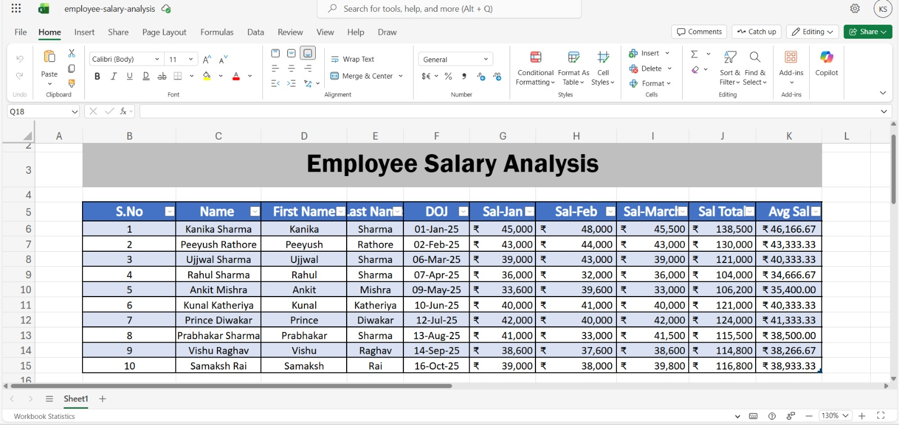
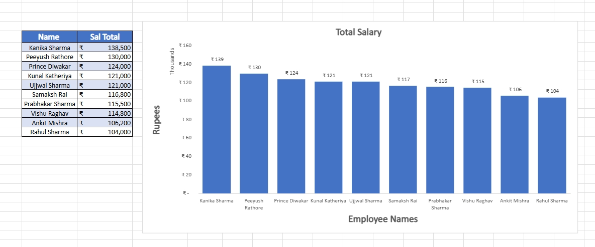

# Employee Salary Analysis

A simple Excel-based project analyzing employee salaries across multiple months(Jan-Mar) using tools like flash, auto drag and excel fromulas like sum and average.

## Features
- Monthly salary tracking (Jan–Mar)
- Total and average salary calculation upto two decimal places 
- Clean tabular structure using Excel tables

## Tools Used
- Microsoft Excel
- Basic formulas (SUM, AVERAGE)

## File
- "employee-salary-analysis.xlsx"
  
## Preview

